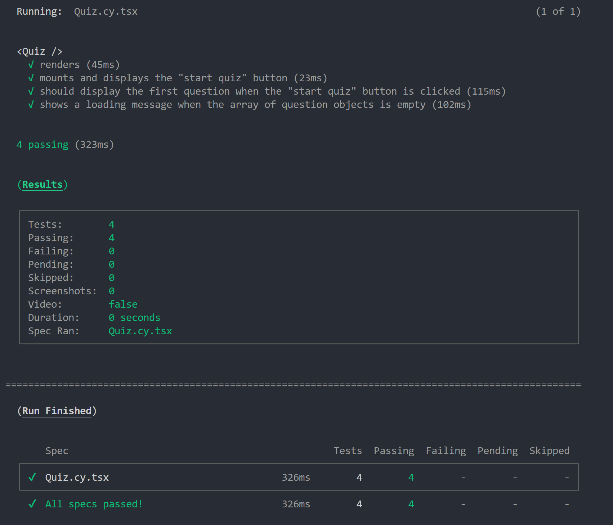

# Tech Quiz Test Suite

                 
## Description

The tech quiz test suite is a Cypress & CLI program that runs tests on a basic web app that gives a quiz to test your knowledge on Python. The program will run 2 end to end and 4 component tests on the program, which should come back successful when the testing is completed. Tests can run either in your CLI or in the Cypress GUI.

## Screenshot
  

## Table of Contents
  
- [Tech Quiz Test Suite](#tech-quiz-test-suite)
  - [Description](#description)
  - [Screenshot](#screenshot)
  - [Table of Contents](#table-of-contents)
  - [Installation](#installation)
  - [Usage](#usage)
  - [License](#license)
  - [Contributing](#contributing)
  - [Credits](#credits)
  - [Tests](#tests)
  - [Questions](#questions)
  
## Installation
  
Prerequisite: You must have node.js and npm (npm is typically included with node) installed in your local git-compatible command line interface prior to installing this program. If you do not have node & npm installed, please follow the installation instructions [here](https://nodejs.org/).\
NOTE: It is recommended that you run this program on a high-performing machine as the app that runs the tests (Cypress) is resource intensive, and may fail to run on lower performing machines.

Download the source code for the project with a <code>git clone</code> on this repository in your CLI using the URL or SSH link provided in the "code" button at the top of this repository. Then, <code>cd</code> in your terminal to the directory that contains the cloned repo, and run an <code>npm i</code> to ensure that you have all required dependencies to run the package successfully.
  
## Usage
  
To use, make sure you are CDed to the directory the source files live in. You can choose to either run the tests directly in the CLI/Terminal or in the Cypress GUI. If running an E2E test, make sure you run an <code>npm run start:dev</code> to start the server. Then, open a new terminal, and run either: <code>npm run test:e2e</code> to run an End to End test in the terminal, <code>npm run test:component</code> to run the component test in your terminal, or <code>npm run cypress</code> to open the Cypress GUI, and run the tests from there. If using the Cypress GUI, simply select which tests you would like to run, select the browser to run the tests in (Electron is most recommended), and then selec the "Quiz" option to run the tests.

The End to End test will check for:\
"should start the quiz when the button is clicked"\
"should display my score when the quiz is completed"

The component test will test for:\
"component renders"\
"mounts and displays the "start quiz" button"\
"should display the first question when the "start quiz" button is clicked"\
"shows a loading message when the array of question objects is empty"

If further instruction is needed, please view walkthrough video: [here]()

## License

This project uses MIT License.

Please refer to LICENSE file for more information.

## Contributing
  
No need to contribute, however feel free to fork and make it your own!
  
## Credits
  
Majory of test code written by jsparrowio (Josh Garrett) with assistance by intructors, activities, and the XPert Learning Chatbot from the edX/UofM Coding Bootcamp. Actual application code provided by edX and their respective developers.
  
## Tests
  
To test, follow usage instructions above.
  
## Questions
  
If you have any additional questions, please contact me at:
  
[GitHub](https://www.github.com/jsparrowio)
  
[jsparrowio@outlook.com](mailto:jsparrowio@outlook.com)